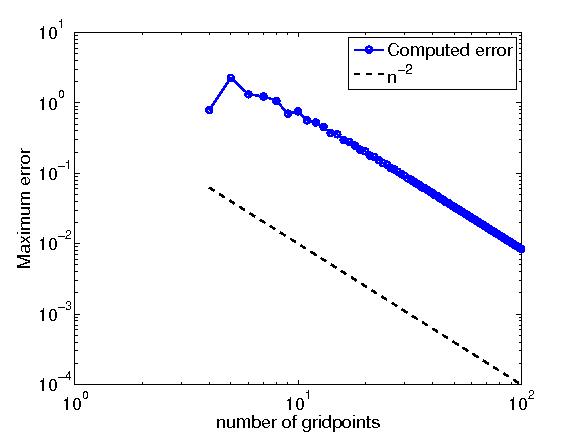
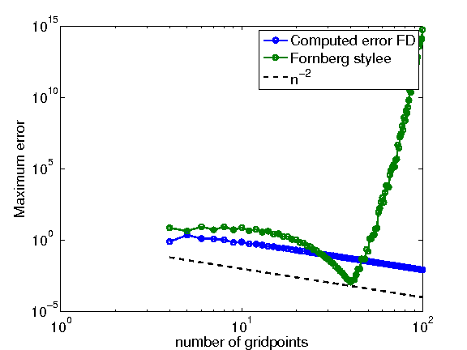
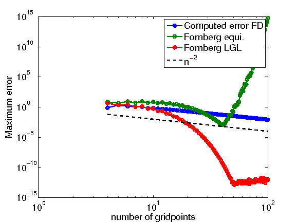

.. -*- rst -*- -*- restructuredtext -*-

.. _FORTRAN_FD_EXAMPLE:

======================================
Finite difference examples in Fortran
======================================

This section discusses implementations of the finite difference approximations discussed in the section :ref:`FDApprox`. The examples can be found in the files ``differentiate_vX.f90`` in the `repository`__. Here we consider an example with a first order derivative. 

First we approximate the derivative using a three point second order accurate stencil on an equidistant grid. Then we use Bengt Fornberg's subroutine ``weights1`` to find the approximation which uses all the function values at all the grid-points to achieve an approximation of maximal order. We will find that the this second approach does not work well on an equidistant grid. In the third example we find that the maximal order of accuracy finite difference stencil (usually called spectral finite differences) gives excellent! results on graded Legendre-Gauss-Lobatto grids. These grids are also discussed in :ref:`HOMEWORK3` in the context of numerical integration.

__ https://bitbucket.org/appelo/math471

Example 1, a low order finite difference method
-----------------------------------------------

To this end consider the function :math:`f(x) = \exp(\cos \pi x)` and its derivative :math:`f'(x) = -\pi \sin (\pi x) \exp(\cos \pi x)` on the domain :math:`x\in[-1,1]`. 

First we consider the approximation (derived in the same way as in the finite difference section)

.. math::
   :nowrap:
   
   \begin{eqnarray}
      (f')_i = \left\{
      \begin{array}{ll}
       \frac{-1.5 f_{i}+2f_{i+1}-0.5 f_{i+2}}{h} & i = 0\\
       \frac{0.5 f_{i+1}-f_{i-1}}{h} & i = 1,\ldots,n-1\\
       \frac{1.5 f_{i}-2f_{i-1} + f_{i-2}}{h} & i = n
      \end{array}
      \right.
   \end{eqnarray} 
  

on the equidistant grid

.. math::
   :nowrap:
   
   \begin{equation}
      x_i = -1 + i h, \, i = 0,\ldots,n, \ \ h = \frac{2}{n}. 
   \end{equation} 
  
As we could find the exact derivative we can now try out our finite difference approximation for a sequence of smaller and smaller :math:`h` to see if the error decreases as we expect. As this means that we will have different number of grid-points for different :math:`h` we declare the array ``x`` to be a single dimension allocatable array (see line 6). The difference stencils on the other hand will be the same independent of the number of grid points and can thus be stored in a fixed size array ``diff_weights(1:3,1:3)``. Note that in Fortran the default indexation starts with one so an equivalent declaration would be ``diff_weights(3,3)``. We also declare the arrays holding the function, the approximation to the derivative and the exact derivative as allocatable. 

The code then loops over all :math:`n=4,5,\ldots,400` and allocates arrays of size :math:`n+1` (``x(0:n)``) (line 10), computes the grid spacing, the grid, the function and the exact derivative (lines 12-18). When the function is known on the grid we set up the array that holds the finite difference weights (note that we bake in the :math:`h` dependence and thus have to change it for every loop) and compute the finite difference approximation to :math:`f'(x)` (lines 23-45). Finally, on line 46 we compute the maximum error on the grid and print it to screen.    

.. code-block:: fortran
 :linenos: 

 program differentiate
   implicit none
   real(kind = 8), parameter :: pi = acos(-1.d0)
   integer :: n,i,j
   real(kind = 8) :: h,diff_weights(1:3,1:3)
   real(kind = 8), dimension(:), allocatable :: x,f,df,df_exact
  
   do n  = 4,100
      ! Allocate memory for the various arrays
      allocate(x(0:n),f(0:n),df(0:n),df_exact(0:n))
      ! Set up the grid.     
      h = 2.d0/dble(n)
      do i = 0,n
         x(i) = -1.d0+dble(i)*h
      end do
      ! The function and the exact derivative
      f = exp(cos(pi*x))
      df_exact = -pi*sin(pi*x)*exp(cos(pi*x))
      
      ! Set up weights for a finite difference stencil 
      ! using three gridpoints
      ! In the interior we use a centered stencil
      diff_weights(1:3,1) = (/-0.5d0,0.d0,0.5d0/) 
      ! To the left we use a biased stencil
      diff_weights(1:3,2) = (/-1.5d0,2.d0,-0.5d0/) 
      ! To the right we use a biased stencil too
      diff_weights(1:3,3) = (/1.5d0,-2.d0,0.5d0/) 
      ! scale by 1/h
      diff_weights = diff_weights/h
      
      ! Now differentiate
      ! To the left is a special case
      df(0) = 0.d0
      do j = 1,3
         df(0) = df(0) + diff_weights(j,2)*f(j-1)
      end do
      ! Now interior points
      do i = 1,n-1
         df(i) = sum(diff_weights(1:3,1)*f((i-1):(i+1)))
      end do
      ! Finally, special case to the right
      df(n) = 0.d0
      do j = 1,3
         df(n) = df(n) + diff_weights(j,3)*f(n-(j-1))
      end do
      write(*,'(I3,2(ES12.4))') n,h,maxval(abs(df-df_exact)) 
 
      ! Deallocate the arrays     
      deallocate(x,f,df,df_exact)
   end do
  
 end program differentiate

The results from the output of the above program is displayed the figure below. As can be seen the slope of the error is the same as a :math:`h^{2} \sim n^{-2}` indicating that the implementation may be correct. 

Example 2, maximum order on an equidistant grid
-----------------------------------------------

.. code-block:: fortran
 :linenos: 

 ! This program differentiates functions
 ! Using a standard second order finite difference stencil
 ! and a difference of maximal width computed by 
 ! Bengt Fornberg's weights subroutine.
 program differentiate
   implicit none
   real(kind = 8), parameter :: pi = acos(-1.d0)
   integer :: n,i,j
   real(kind = 8) :: h,diff_weights(1:3,1:3)
   real(kind = 8), dimension(:), allocatable :: x,f,df,df_exact
   ! Variables for weights
   integer :: nd,m
   real(kind = 8) :: z 
   real(kind = 8), dimension(:,:), allocatable :: c
  
   m = 1
   do n  = 4,100
      ! Allocate memory for the various arrays
      allocate(x(0:n),f(0:n),df(0:n),df_exact(0:n))
      allocate(c(0:n,0:m))
      ! Set up the grid.     
      h = 2.d0/dble(n)
      do i = 0,n
         x(i) = -1.d0+dble(i)*h
      end do
      ! The function and the exact derivative
      f = exp(cos(pi*x))
      df_exact = -pi*sin(pi*x)*exp(cos(pi*x))
   
      !!!! SKIPPING SOME REDUNDANT CODE HERE (SEE ABOVE)!!!!
 
      ! Finally, special case to the right
      df(n) = 0.d0
      do j = 1,3
         df(n) = df(n) + diff_weights(j,3)*f(n-(j-1))
      end do
      write(*,'(I3,2(ES12.4))',advance='no') n,h,maxval(abs(df-df_exact))

      ! Now find the difference stencil that uses all the points 
      nd = n
      do i = 0,n
         df(i) = 0.d0
         z = x(i)
         call weights1(z,x,n,nd,m,c)
         do j = 0,nd
            df(i) = df(i) + c(j,1)*f(j)
         end do
      end do
      write(*,'(ES12.4)') maxval(abs(df-df_exact))
      
      ! Deallocate the arrays     
      deallocate(x,f,df,df_exact,c)
   end do
 end program differentiate

Example 3, maximum order on a Legendre-Gauss-Lobatto grid
---------------------------------------------------------

.. code-block:: fortran
 :linenos: 

 !
 ! This program differentiates functions
 ! Using a standard second order finite difference stencil
 ! and a difference of maximal width computed by 
 ! Bengt Fornberg's weights subroutine.
 ! This third version adds differentiation on a 
 ! Legendre-Gauss-Lobatto grid.

 program differentiate
   implicit none
  
    !!!! SKIPPING SOME REDUNDANT CODE HERE (SEE ABOVE)!!!!

   do n  = 4,100
     ! Allocate memory for the various arrays
     allocate(x(0:n),f(0:n),df(0:n),df_exact(0:n),w(0:n))

     !!!! SKIPPING SOME REDUNDANT CODE HERE (SEE ABOVE)!!!!

     ! The above approach is plagued by numerical 
     ! roundoff due to ill-conditioning. 
     ! A much better grid distribution is the LGL nodes. 
     call lglnodes(x,w,n)
     f = exp(cos(pi*x))
     df_exact = -pi*sin(pi*x)*exp(cos(pi*x))
     ! Now find the difference stencil that uses all the points 
     nd = n
     do i = 0,n
        df(i) = 0.d0
        z = x(i)
        call weights1(z,x,n,nd,m,c)
        do j = 0,nd
           df(i) = df(i) + c(j,1)*f(j)
        end do
     end do
     write(*,'(ES12.4)') maxval(abs(df-df_exact))
     
     ! Deallocate the arrays     
     deallocate(x,f,df,df_exact,c,w)
   end do
 end program differentiate

