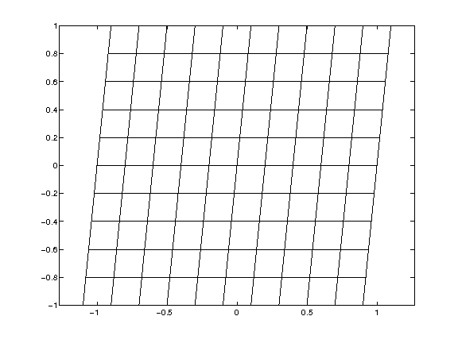

.. -*- rst -*- -*- restructuredtext -*-

================================
Homework 4, due 08.00, 24/9-2014
================================

Curvilinear coordinates
-----------------------

The files relevant to this homework reside in ``codes/fortran/HWK4``.  

In this homework you will compute derivatives and integrals on a logically rectangular domain (i.e. it has four sides and no holes) :math:`\Omega`. The strategy is to use a smooth mapping :math:`(x,y)=(x(r,s),y(r,s))` from the reference element :math:`\Omega_R = \{(r,s) \in [-1,1]^2` \} to :math:`\Omega` to "transfer" the computations to the reference element. 

For example if we want to approximate :math:`\frac{\partial u(x,y)}{\partial x}` we use the chain rule to find

.. math::
   :nowrap:
  
   \begin{equation*}
     \frac{\partial u(x(r,s),y(r,s))}{\partial x} = \frac{\partial r}{\partial x}\frac{\partial u}{\partial r}+\frac{\partial s}{\partial x}\frac{\partial u}{\partial s}, 
   \end{equation*}

and similarly for 

.. math::
   :nowrap:
  
   \begin{equation*}
     \frac{\partial u(x(r,s),y(r,s))}{\partial y} = \frac{\partial r}{\partial y}\frac{\partial u}{\partial r}+\frac{\partial s}{\partial y}\frac{\partial u}{\partial s}. 
   \end{equation*}

We can then introduce a Cartesian grid on the reference element:

.. code-block:: fortran

  hr = 2.d0/dble(nr)
  hs = 2.d0/dble(ns)
  do i = 0,nr
     r(i) = -1.d0 + dble(i)*hr
  end do
  do i = 0,ns
     s(i) = -1.d0 + dble(i)*hs
  end do

to find :math:`u_r` and :math:`u_s` by standard finite difference formulas (see the subroutine ``differentiate``.) To find the metric :math:`r_x, r_y, s_x, s_y` we can first compute :math:`x_r, x_s, y_r, y_s` and then use the above formulas with :math:`u = x` and :math:`u = y`. This yields 

.. math::
   :nowrap:
  
   \begin{equation*}
   \left[
   \begin{array}{cc}
   r_x & s_x \\
   r_y & s_y 
   \end{array} 
   \right]
   \left[
   \begin{array}{cc}
   x_r & y_r \\
   x_s & y_s 
   \end{array} 
   \right] =
   \left[
   \begin{array}{cc}
   1 & 0 \\
   0 & 1
   \end{array} 
   \right].
   \end{equation*}

It is also possible to compute integrals on the reference element. For example, we have that

.. math::
   :nowrap:
  
   \begin{equation*}
   \int_{\Omega} f(x,y) dxdy = \int_{-1}^1 \int_{-1}^1 f(x(r,s),y(r,s)) \, J(r,s) \, d r d s,   
   \end{equation*}

where :math:`J(r,s) = x_r y_s - x_s y_r` is the surface element. The second integrand can be approximated on the reference element, for example with the trapezoidal rule.

Assignments: 
 
 0. Make and run the program ``homework4.f90`` and use the Matlab script (or some other plotting tool) to display the grid.  
 1. Use the above formula to find (compute numerically) the metric :math:`r_x, r_y, s_x, s_y`. 
 2. Check that the results from 1) are correct by changing the mapping in ``xycoord.f90`` to map the reference element into some geometrical shape for which you know the area (for example a sector of an annulus) and compute it on the reference element using the trapezoidal rule.
 3. Compute :math:`u_x` and :math:`u_y` for some different functions :math:`u(x,y)` and some different mappings. Write a subroutine that approximates the error

    .. math::
       :nowrap:
  
       \begin{equation*}
       e_2(h_r,h_s) = \left(\int_{\Omega} \left(u_x(x,y)+u_y(x,y) - \left[(u_{\rm exact})_x + (u_{\rm exact})_y \right]  \right)^2  dxdy \right)^{1/2},
       \end{equation*}
 
    and plot the error as a function of the grid spacing for the different functions and the different mappings. 

 4. Use the chain rule to find an expression for :math:`\Delta u = u_{xx}+u_{yy}`. Discretize it and repeat the experiments above (optional).
 5. Write up your findings neatly as a report and check it in to your repository.

Sample results
--------------
Below we give some sample results, note that the errors are messured in the max-norm so the results you produce are not going to be identical. Also note that the errors are plotted as a function of an effective gridsize :math:`h_{\rm eff} = \sqrt{h_r h_s \max J}` Here we use 3 combinations of grids and functions: 

The three combinations are

.. code-block:: fortran
  
  ! Combination 1 
  x_coord = r+0.1d0*s
  y_coord = s
  u = sin(xc)*cos(yc)

  ! Combination 2 
  x_coord = (2.d0+r+0.1d0*sin(5.d0*pi*s))*cos(0.5d0*pi*s)
  y_coord = (2.d0+r+0.1d0*sin(5.d0*pi*s))*sin(0.5d0*pi*s)
  u = exp(xc+yc)

  ! Combination 3
  x_coord = r        
  y_coord = s + s*r**2
  u = xc**2+yc**2

And the grids and results are: 

